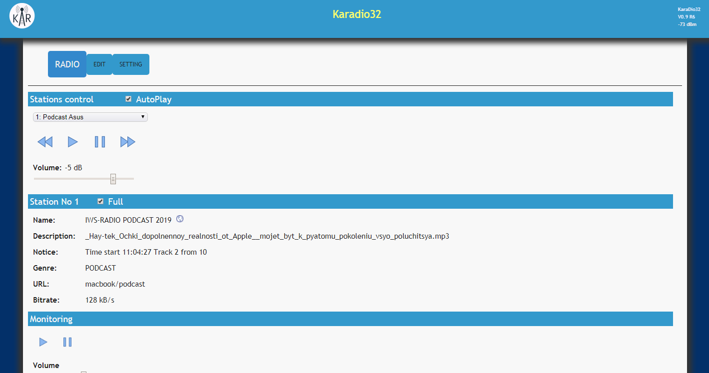

# IWScast
Broadcast from your computer mp3 files. 

Allows broadcast online your mp3 files. Only PHP. No MySQL.
You can listen stream on a computer, smartphone, TV set-top box, internet-receiver.
Can be used on older computers. Works great on computer CPU - 900 MHz, RAM - 512 Mb. 

Requirements: 
Ubuntu 12.04+, Apache2, php5.3 or php7

1. Install Apache2 and php.
2. Upload script index.php and files mp3 in webserver directory (/var/www/)
3. Set correct file permissions 
Everything is now ready to go.

In folder Music script for Random play files.

In folder Podcast script for play of podcast. Script remembers the last file. The next time you turn it on, it plays the next track. 

You can set the desired track in file counter.dat for listening. The script has a log that displays the listened files.

I am using an internet receiver KA-Radio32.
https://github.com/karawin/Ka-Radio32

